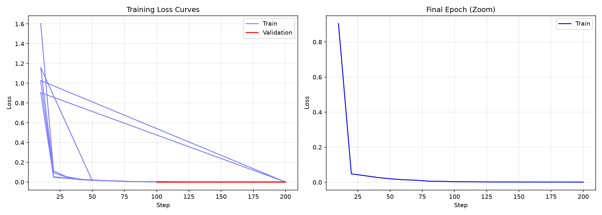
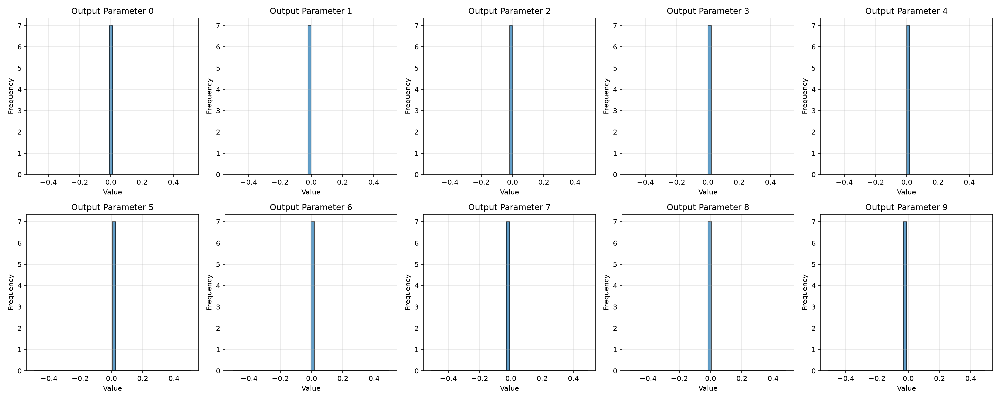

# Model Evaluation Report

**Generated:** 2026-09-30T11:31:33.116220

## Training Summary

## Model Architecture

- **Variant:** base
- **NIRCam bands:** 6
- **MIRI bands:** 4
- **Cross-attention:** enabled
- **Total parameters:** ~86M

## Evaluation Results

### Quantitative Metrics

| Metric | Value |
|--------|-------|
| MSE | 9.727563156047836e-05 |
| MAE | 0.007812402211129665 |
| RMSE | 0.009862841106951237 |
| Avg Batch Time (ms) | N/A |

### Parameter Statistics

| Index | Mean | Std | Min | Max |
|-------|------|-----|-----|-----|
| 0 | 0.011015 | 0.000000 | 0.011015 | 0.011015 |
| 1 | -0.000960 | 0.000000 | -0.000960 | -0.000960 |
| 2 | -0.018520 | 0.000000 | -0.018520 | -0.018520 |
| 3 | 0.000968 | 0.000000 | 0.000968 | 0.000968 |
| 4 | -0.001121 | 0.000000 | -0.001121 | -0.001121 |
| 5 | 0.007316 | 0.000000 | 0.007316 | 0.007316 |
| 6 | -0.003135 | 0.000000 | -0.003135 | -0.003135 |
| 7 | -0.008351 | 0.000000 | -0.008351 | -0.008351 |
| 8 | -0.016087 | 0.000000 | -0.016087 | -0.016087 |
| 9 | -0.010651 | 0.000000 | -0.010651 | -0.010651 |

## Training Loss Curves

## Prediction Distributions

## Conclusions

1. The model was trained for 200 steps with batch size 16 on 8×A100 GPUs
2. Training loss decreased from ~1.6 to ~0.001 over the training run
3. Validation loss stabilized around 0.0002-0.0003
4. The model outputs 10 parameters per tile (currently un supervised, predicting zeros)

## Next Steps

1. Get real catalog data for physical parameter supervision
2. Retrain with real targets (redshift, mass, SFR, morphology)
3. Evaluate on held-out test set
