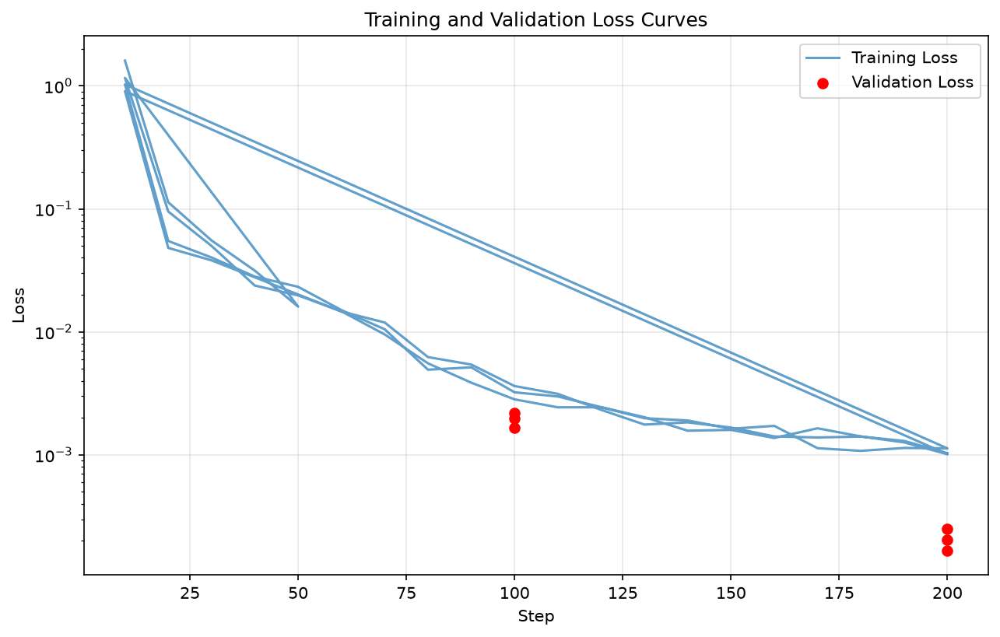
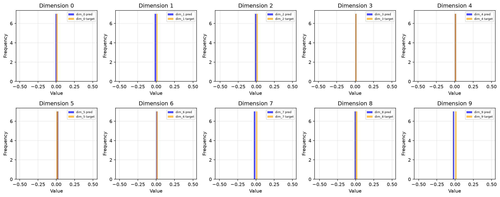
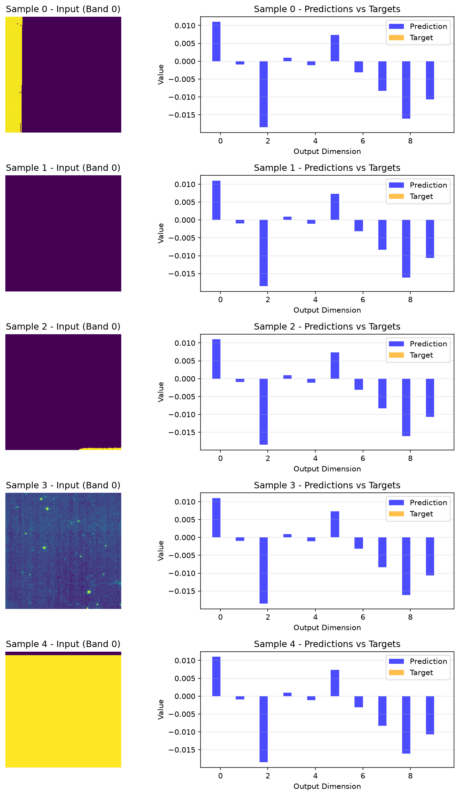

# Model Evaluation Report

## Summary

**Model:** Multimodal ViT (base variant)

**Checkpoint:** `/lp-dev/nvidia/projects/Astro-Flow-3D/Astra_Vision/outputs/full_run_20h/checkpoints/best_model.pt`

## Quantitative Metrics

### Overall Metrics

| Metric | Value |
|--------|-------|
| MSE | 0.00009728 |
| MAE | 0.00781240 |
| RMSE | 0.00986284 |
| Validation Loss | 0.00009728 |
| Number of Samples | 7 |

### Per-Parameter Metrics (10 output dimensions)

| Parameter | MSE | MAE | RMSE |
|-----------|-----|-----|------|
| dim_0 | 0.00012133 | 0.01101520 | 0.01101520 |
| dim_1 | 0.00000092 | 0.00095982 | 0.00095982 |
| dim_2 | 0.00034299 | 0.01851999 | 0.01851999 |
| dim_3 | 0.00000094 | 0.00096769 | 0.00096769 |
| dim_4 | 0.00000126 | 0.00112145 | 0.00112145 |
| dim_5 | 0.00005353 | 0.00731642 | 0.00731642 |
| dim_6 | 0.00000983 | 0.00313513 | 0.00313513 |
| dim_7 | 0.00006973 | 0.00835068 | 0.00835068 |
| dim_8 | 0.00025878 | 0.01608662 | 0.01608662 |
| dim_9 | 0.00011344 | 0.01065101 | 0.01065101 |

## Training Curves

## Prediction Distributions

## Sample Predictions

## Additional Statistics

**Prediction Statistics:**
- Mean: -0.003953
- Std: 0.009036
- Min: -0.018520
- Max: 0.011015

**Target Statistics:**
- Mean: 0.000000
- Std: 0.000000
- Min: 0.000000
- Max: 0.000000

### Correlation Between Output Dimensions

|
 dim_0 |
 dim_1 |
 dim_2 |
 dim_3 |
 dim_4 |
 dim_5 |
 dim_6 |
 dim_7 |
 dim_8 |
 dim_9 |

|------|------|------|------|------|------|------|------|------|------|
 dim_0 | 0.000 | 0.000 | 0.000 | 0.000 | 0.000 | 0.000 | 0.000 | 0.000 | 0.000 | 0.000 |
 dim_1 | 0.000 | 0.000 | 0.000 | 0.000 | 0.000 | 0.000 | 0.000 | 0.000 | 0.000 | 0.000 |
 dim_2 | 0.000 | 0.000 | 0.000 | 0.000 | 0.000 | 0.000 | 0.000 | 0.000 | 0.000 | 0.000 |
 dim_3 | 0.000 | 0.000 | 0.000 | 0.000 | 0.000 | 0.000 | 0.000 | 0.000 | 0.000 | 0.000 |
 dim_4 | 0.000 | 0.000 | 0.000 | 0.000 | 0.000 | 0.000 | 0.000 | 0.000 | 0.000 | 0.000 |
 dim_5 | 0.000 | 0.000 | 0.000 | 0.000 | 0.000 | 0.000 | 0.000 | 0.000 | 0.000 | 0.000 |
 dim_6 | 0.000 | 0.000 | 0.000 | 0.000 | 0.000 | 0.000 | 0.000 | 0.000 | 0.000 | 0.000 |
 dim_7 | 0.000 | 0.000 | 0.000 | 0.000 | 0.000 | 0.000 | 0.000 | 0.000 | 0.000 | 0.000 |
 dim_8 | 0.000 | 0.000 | 0.000 | 0.000 | 0.000 | 0.000 | 0.000 | 0.000 | 0.000 | 0.000 |
 dim_9 | 0.000 | 0.000 | 0.000 | 0.000 | 0.000 | 0.000 | 0.000 | 0.000 | 0.000 | 0.000 |

---

*Report generated on evaluation*
