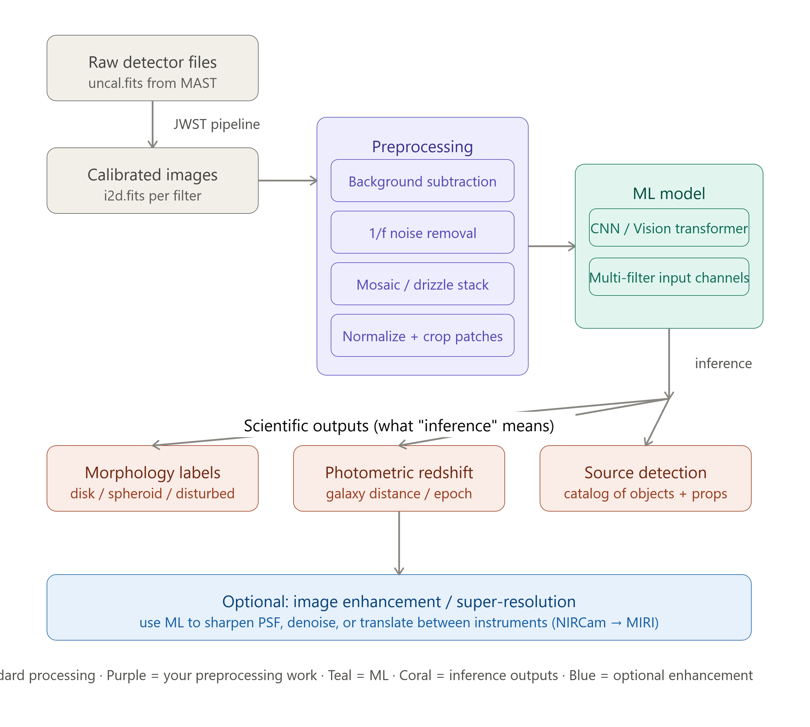
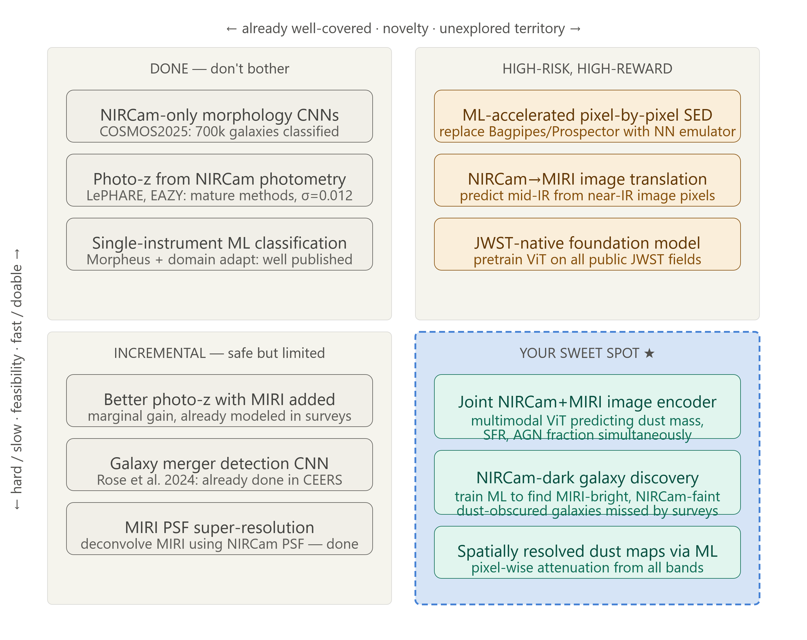
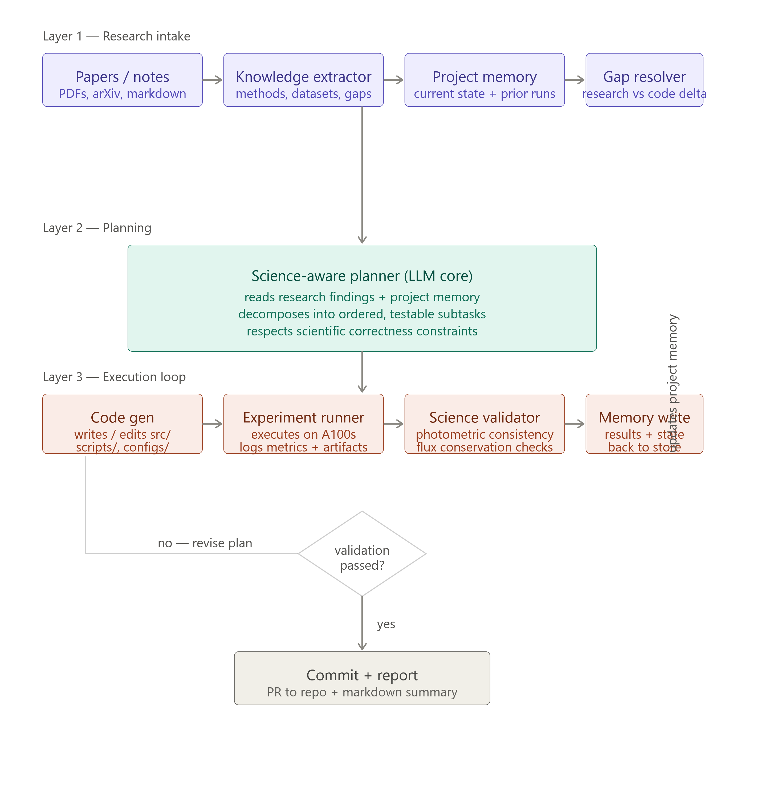

# Idea

Okay, this is a genuinely exciting project and you're not as lost as you think — you just need the conceptual map first. Let me break down what's happening in this space and what "inference" means here.

Here's what's actually going on and why your instinct is solid:

**"Inference" in this context means two different things**

In ML, *inference* simply means running a trained model on new data to get predictions. But in *astronomy*, it means drawing scientific conclusions — estimating a galaxy's distance, age, stellar mass, or morphological type. Your plan is to use ML inference (the computation) to produce scientific inference (the knowledge). Both definitions apply here and that's actually the state of the art right now.

**What the raw JWST files are and why multiple filters matter**

NIRCam covers 0.6 to 5 μm using simultaneous short and long wavelength channels across a range of narrow, medium, and broad filters. MIRI extends coverage from 4.9 to 28.8 μm across 9 broadband filters. Each filter sees different physical phenomena — ionized hydrogen, dust emission, stellar continuum, molecular lines. When you stack these as separate channels into an ML model (like RGB but with 8–17 bands), the model can learn which combination of bands predicts which physical property. That's the core idea.

**What the pipeline actually looks like**

The standard approach runs through three stages: Stage 1 (detector-level calibration), Stage 2 (image-level calibration), and Stage 3 (mosaicking), with custom steps added on top — particularly for 1/f noise removal in NIRCam and background subtraction. The community pipeline for this is `jwst` (STScI's official package), and teams like JADES combine the official JWST calibration pipeline with custom steps to optimize warm/hot pixel flagging and background subtraction.

**What people are actually doing with ML + JWST right now**

The first-ever AI/ML analysis of JWST images used a deep learning model called Morpheus — originally trained on Hubble data — to classify galaxy morphologies. Of 160 faint galaxies Morpheus classified as disks from JWST, it had only considered 5% of them disk-like in Hubble data, because JWST resolved structure that Hubble couldn't.

CNNs trained on HST images have been domain-adapted to JWST/NIRCam to classify ~20,000 galaxies into spheroid, disk+spheroid, disk, and disturbed categories across redshift 0–6.

There's also a newer wave using diffusion models and other generative approaches for image restoration through super-resolution, denoising, and image translation between telescope domains.

**Where your 32K A100 hours are genuinely useful**

This is an enormous compute budget. The bottleneck in this field right now is not compute — it's labeled training data and well-calibrated preprocessing. With 32K hours you could realistically:

1. Build a multi-filter encoder (Vision Transformer or CNN) trained on JWST NIRCam + MIRI combined to predict photometric redshifts or stellar masses — a task where the multi-wavelength coverage is a genuine advantage over prior work
2. Train a super-resolution / PSF deconvolution model (MIRI has worse spatial resolution than NIRCam — you can try to up-sample using NIRCam as ground truth)
3. Build a source detection and morphology catalog across multiple public JWST fields

**Concrete first steps**

- Data source: MAST archive (`mast.stsci.edu`) — all JWST data is public after a 12-month exclusive period; most early programs are already open
- Calibration: `pip install jwst` — STScI's official pipeline, runs the standard 3-stage reduction
- Custom noise removal: look at PJPIPE (PHANGS-JWST pipeline) on GitHub
- ML starting point: the Morpheus codebase (Robertson et al. 2023) and AstroPT (a vision transformer pretrained on astronomical images)

The most novel and tractable version of your project would be: take multi-filter NIRCam + MIRI cutouts of thousands of galaxies, use the multi-band stack as input channels to a ViT or CNN, and predict morphology + photometric redshift jointly. That's publishable science, it directly uses your multi-filter insight, and 32K A100 hours is more than enough. Want me to go deeper on any specific stage — preprocessing, model architecture, or what labeled datasets exist?

# Viability

Let me search for the current state of the art to give you an honest answer.Now I have a clear picture of the landscape. Here's an honest, research-backed assessment:

Here's the honest answer — with real specifics.

**What's already saturated**

The field moved fast. COSMOS2025 has already produced ML-based morphological classification and photometric redshifts across 700,000 galaxies using NIRCam+MIRI photometry in 37 bands. Their photo-z validation against 12,000 spectroscopic redshifts reaches σ_MAD = 0.012, a factor-two improvement over pre-JWST work. Basic "use multiple filters, train a CNN, classify morphology" is genuinely done at scale. You would not be competitive there.

**The real gap — and why your MIRI instinct is right**

The critical insight is this: almost all ML work so far treats MIRI as one more photometric data point in a catalog, not as an *image*. The majority of these systems are composites where stellar emission dominates the optical/near-IR — they are difficult to distinguish from purely star-forming galaxies using NIRCam photometry alone. MIRI's spatial morphology at mid-infrared wavelengths carries dust geometry information that NIRCam aperture fluxes simply don't capture — and nobody has built a model that learns from both images simultaneously as a joint representation.

Even sophisticated per-pixel SED fitting work explicitly excludes MIRI from the pixel-level analysis because the resolution mismatch between MIRI and NIRCam is a hard unsolved problem — MIRI's PSF is 3× worse than NIRCam at F444W. That's where your compute budget becomes genuinely valuable: learning to model across the PSF mismatch is expensive and nobody has done it at scale with a data-driven approach.

**Three concrete directions that are novel and viable**

The teal boxes in the diagram are where I'd focus. The most tractable and highest-impact is the joint NIRCam+MIRI multimodal encoder — a Vision Transformer that takes NIRCam cutouts in all available bands *and* MIRI cutouts (at native resolution, with the PSF mismatch handled by a learned cross-attention layer rather than degrading the NIRCam images) and predicts physical parameters like dust mass, star formation rate, and AGN fraction simultaneously. This doesn't exist. The COSMOS-Web and JADES teams use classical SED fitting for this; what's explicitly flagged as "particularly needed" is a fully consistent modeling framework that reproduces galaxy properties across both the optical/stellar and infrared/dust parts of the spectrum jointly.

The second direction — NIRCam-dark galaxy discovery — is scientifically hot right now. MIRI has already detected emission lines in a galaxy at z=14.32 and found "NIRCam-dark, MIRI-only detections" that suggest a new population of high-z emission line galaxies that standard NIRCam-driven surveys simply miss. A model trained specifically to find MIRI-bright but NIRCam-faint objects — heavily dust-obscured galaxies and some AGN — would be genuinely new and very publishable.

**Can it surpass existing methods?**

On traditional metrics (photo-z accuracy, morphology classification accuracy) for typical galaxies — probably not, because those are mature. But on the specific problem of *dust-obscured systems* and *spatially resolved dust properties*, existing methods are explicitly failing and admitting it in print. That's where you can win. The compute angle is real too: classical pixel-by-pixel SED fitting with Bagpipes takes hours per galaxy; a trained neural emulator can do the same in milliseconds. Current spatially-resolved SED fitting work is computationally prohibitive enough that most photometric studies still use unresolved integrated fitting — a fast ML substitute that scales to millions of pixels across thousands of galaxies is a genuine contribution.

**The bottom line**

Viable: yes, strongly. Novel: yes, if you focus on the joint image-level NIRCam+MIRI modeling rather than photometry catalogs. The most defensible framing is not "better galaxy classifier" — it's "the first model that learns spatially-resolved dust physics jointly from two instruments at different resolutions." That framing is accurate, it's timely, and 32K A100 hours is exactly what you'd need to do it properly. Want me to sketch what the actual architecture and training setup would look like?

# Setup

Read both documents carefully. Now let me think through this properly before responding.

The project is at a very specific inflection point: it has a clean single-band tiling pipeline and is about to cross into multi-band territory. The Copilot conversation already mapped the scientific roadmap well. The question is: what research nudges are most valuable *right now*, and what does an autonomous agent actually need to do with that research?

---

## 1. Research Directions (nudges only)

The project sits at the boundary between three fields that rarely talk to each other well. Here's where to look, without specific papers:

**A. The PSF Mismatch Problem is the First Blocker**
Before any multi-band ML, you need spatially co-registered images where each pixel means the same thing across bands. Look into *image deconvolution under spatially varying PSFs*, specifically the family of methods that treat PSF matching as a Wiener filtering problem in Fourier space. Then look at how radio astronomy handles the analogous "dirty beam" problem — they solved this decades ago. The JWST-specific wrinkle is that NIRCam's PSF is undersampled at short wavelengths, so look at *drizzle-aware PSF reconstruction* and what WebbPSF provides vs. what you need to learn empirically.

**B. Physically Meaningful Normalization**
The current pipeline does percentile-clipping to [0,1]. That discards the physical flux scale. Before training any model you should understand *surface brightness units* (MJy/sr in JWST I2D products), *AB magnitude system*, and the concept of *flux-calibrated multi-band stacks*. The question to research: what normalization preserves the *ratios* between bands, since those ratios are what encode physical information (stellar temperature, dust reddening, redshift)? Look into asinh stretching (used in SDSS) and its physical motivation.

**C. What "3D" Should Actually Mean for This Project**
The Copilot answer identified the ambiguity. The research nudge: look at *Spectral Energy Distribution (SED) fitting* as the classical version of what the ML model needs to learn. SED fitting takes multi-band fluxes per pixel and outputs physical parameters (stellar mass, age, dust attenuation, star formation rate). The ML model's job is to learn this mapping — but spatially resolved and much faster. This connects to *neural SED emulators*, which replace slow Bayesian SED codes with trained networks. That's the concrete scientific definition of "3D" for this project: a per-pixel latent space whose axes are physical parameters, not geometric depth.

**D. The Supervision Problem**
You need labels or a self-supervised strategy. Two directions worth researching in parallel:
- *Masked autoencoder pretraining on multi-band astronomical images* — what does masking mean when bands are the channels? Masking entire bands (not spatial patches) is a more physically motivated pretraining task because it forces the model to learn inter-band relationships.
- *Simulation-based inference (SBI)* — look at how cosmologists use neural posterior estimators trained on simulations to infer physical parameters without explicit likelihood functions. IllustrisTNG and FIRE simulations render mock JWST observations; using those as training supervision is the cleanest path to physically grounded labels.

**E. The Tile Boundary Problem**
The current 256×256 tiling is arbitrary and will cause boundary artifacts in any spatial model. Research *overlapping patch strategies with learned blending*, and more importantly, look at how medical imaging (whole-slide pathology specifically) handles the same problem at scale — that field solved tile-boundary artifacts years ago and the solutions transfer directly.

---

## 2. Agent Outline

The agent's job is: *given a body of research (papers, notes, findings), decide what to implement next in the pipeline, implement it, validate it scientifically, and update the project state.* This is not a retrieval agent — it's a **research-to-code execution loop**.---

## 1. Research directions (nudges only)

The project is at the seam between data engineering and the first real ML work. Here's where to look, in priority order for *your actual current state*:

**A. Flux-preserving normalization**
Your pipeline normalizes to [0,1] with percentile clipping, which destroys inter-band ratios. Before adding any second filter band, look into *asinh stretching* (Lupton et al., used in SDSS) and the concept of *surface brightness conservation across normalizations*. The question to research: what normalization keeps `band_A / band_B` physically meaningful after the transform? That ratio is the SED signal your model needs to learn.

**B. PSF-aware multi-band alignment**
When you add NIRCam filters, each band has a different PSF FWHM — sharper at short wavelengths, blurrier at long. Before stacking them as channels, look into *PSF homogenization via convolution kernels* (the classical approach) and separately *learned PSF matching* (the ML approach where you let the model learn to bridge the resolution gap rather than pre-degrading the better images). The tradeoff is important: pre-degrading is scientifically conservative but throws away real spatial information from the sharper bands.

**C. Masked band pretraining**
Your immediate next ML experiment should be self-supervised. Look into *masked autoencoders* (He et al. 2021 on MAE is the reference) and specifically ask: what does "masking" mean in a multi-band astronomical context? Masking spatial patches is the standard approach, but masking entire bands is a more physically motivated pretraining task for your use case — it forces the model to learn to predict one filter from others, which is *exactly* the inter-band physical relationship you want. This gives you labeled training signal for free from your existing unlabeled data.

**D. Simulation-as-ground-truth**
For the 3D reconstruction goal, you need labels for physical parameters (dust mass, SFR, stellar mass) that don't exist in the images themselves. Research the IllustrisTNG and FIRE simulation suites — they produce mock galaxy images that can be rendered through JWST filter+PSF+noise models. Look into *simulation-based inference (SBI)* and *neural posterior estimation* — these are the techniques that let you train on simulations and apply to real data without knowing the likelihood function explicitly.

**E. The tile boundary problem**
Your current 256×256 tiles with reconstruction validation are a solid foundation. Before training any spatial model, look into *overlapping tile inference with Gaussian weighting* for boundary reconciliation — used heavily in whole-slide pathology imaging. Also look at what `astropy`'s `Reprojection` package does differently from a naive tile-and-stitch, and whether your current MSE/MAE metrics would catch a systematic boundary artifact at the subpixel level.

---

## 2. Agent outline

The agent takes research (papers, findings, notes) and autonomously advances the pipeline. It is a *closed research-to-code loop*, not a chatbot. Here's what each layer actually does:

**Layer 1 — Research intake**
The agent reads incoming research (papers as PDFs, arXiv abstracts, your own notes) and extracts a structured representation: what method, what dataset, what claimed improvement, what are the assumptions. It cross-references this against the project's current state (your `README.md` and a live status tracker) to produce a "delta" — what this research implies should change in the pipeline. This is the only LLM-heavy, unstructured-input stage.

**Layer 2 — Science-aware planner**
An LLM with a carefully designed system prompt that knows the project structure (`src/`, `scripts/`, `configs/`), the scientific constraints (flux conservation, PSF physics, the meaning of FITS HDU extensions), and the current roadmap. It takes the research delta and produces an ordered list of testable subtasks: "add multi-band alignment to `pipeline.py`", "write a reconstruction test that measures inter-band flux ratio preservation", "train a 2-band masked autoencoder on CEERS tiles for 10 epochs". Each subtask has an explicit scientific validation criterion, not just a code correctness criterion.

**Layer 3 — Execution loop**
Four nodes in sequence: code generation writes to the actual repo, experiment runner executes on your A100s and logs to an experiment tracker, science validator checks the outputs against the validation criterion (not just loss curves — actual physical checks like whether the flux ratio between F115W and F444W is preserved after normalization), and memory writer updates the project state. The loop retries with a revised plan on failure rather than terminating. On success it opens a PR and writes a markdown summary of what was learned.

The feedback arrow from the final commit back into project memory is the most important part — the agent accumulates a growing understanding of what has and hasn't worked, which informs every subsequent planning cycle.

---

## 3. What to actually build this with

None of LangChain, N8N, or generic "deep agent" frameworks are the right fit here. Here's why, and what is:

**The core problem with off-the-shelf frameworks:** LangChain and LangGraph give you a lot of plumbing for chatbot-style agents that react to user messages. Your agent is fundamentally different — it runs long, expensive GPU experiments, needs to reason about scientific correctness (not just code correctness), and must maintain state across days-long experimental cycles. N8N is a no-code workflow tool that would fight you at every step the moment any node requires scientific judgment.

**What to actually use:**

The right stack is **LangGraph for the planning/decision graph + Modal or RunPod for GPU execution + a simple SQLite or JSON file as project memory + GitHub API for commits/PRs.** Here's the rationale for each choice:

LangGraph (not LangChain) is right for the planning layer because it lets you define explicit graph nodes with typed state, handles the retry loop natively, and lets you inject human-in-the-loop checkpoints — important for a scientific project where you don't want the agent autonomously burning 5,000 A100 hours on a bad idea. You define the planner, executor, validator, and memory-writer as nodes, and the decision diamond (validation passed?) as a conditional edge.

Modal or RunPod for GPU execution rather than running it on the agent itself — the agent submits jobs, polls for completion, and reads results. This decouples the agent's reasoning loop (cheap, fast, CPU) from the actual training (expensive, slow, GPU). The agent never "is" the GPU process; it orchestrates it.

Project memory as a flat JSON file or SQLite database that lives in your repo. Don't use a vector database for this — you don't need semantic search over past experiments, you need a structured log of what was tried, what succeeded, and what the current pipeline state is. A simple schema: `{experiment_id, subtask, hypothesis, result, validation_passed, timestamp}`.

The one thing to avoid: don't give the agent autonomous access to push to `main`. Have it open PRs that you review. The science validator catches obvious failures, but the agent can't know that a loss curve that looks fine is actually fitting to a PSF artifact. Human review of PRs is your safeguard against the agent being confidently wrong about something physically meaningful.

The total implementation is probably 600–800 lines of Python — no framework needed beyond LangGraph and whatever experiment tracking you already use (W&B or MLflow). Start with the planner and memory writer nodes first; hardcode the execution for the first few cycles to validate the planning quality before wiring in autonomous GPU submission.
