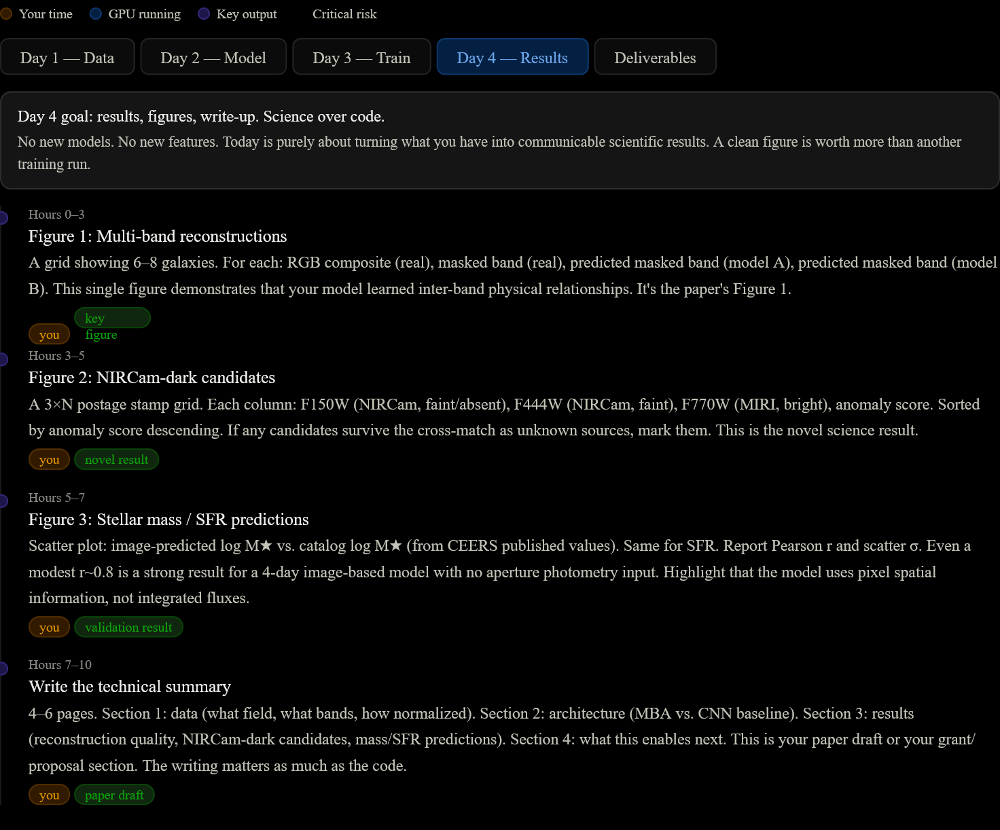

Four days, 8×A100s. Let me think about this precisely before answering.Good. I know exactly where the project stands. Let me be ruthlessly honest about what 4 days actually means.

**The real constraint isn't compute — it's time.** 8×A100s is enormous. 4 days is ~96 hours of *your* working time, not GPU time. The GPUs can run 24/7; you cannot. Every hour you spend debugging data pipelines is an hour not spent on science. So the plan must minimize pipeline work and maximize time on the things that actually matter.

Here's the honest map:

Walk through each day tab — the full breakdown is there. Here's the strategic logic behind the plan:

**Why this specific scope**

Everything cut from the list is cut for one reason: it can't be *validated* in 4 days. A 3D reconstruction you can't verify is worse than nothing — you can't know if it's physically meaningful. The Masked Band Autoencoder and the NIRCam-dark catalog are both *self-validating*: the MBA reconstruction quality is directly measurable (did it predict the right color for the right galaxy?), and the NIRCam-dark candidates are directly inspectable (do they show up in MIRI but not NIRCam?).

**Why the MBA is the right first model**

It's the only architecture that produces a novel scientific result *without labels*. You have no ground-truth 3D galaxy structures, no spectroscopic redshifts for your whole field, no stellar mass measurements at pixel resolution. But you have multi-band images. The MBA turns the band structure itself into the supervision signal — predict F444W from F115W+F200W+F356W. When it works, it has demonstrably learned inter-band physical relationships, which is the foundational claim of Astro-Flow-3D.

**Why NIRCam-dark detection is the right science target**

It's the one result from our earlier analysis that requires no labels, emerges naturally from the MBA's reconstruction error, is genuinely novel (no published ML approach does this at the image level), and produces a catalog you can point at. One confirmed NIRCam-dark source that wasn't in the existing catalog is a result. You don't need hundreds.

**The number that matters most on Day 4**

Pearson r on the stellar mass scatter plot. If r > 0.85 comparing image-predicted masses to published CEERS catalog masses, you have a strong case that the encoder learned physically meaningful representations from images alone — without aperture photometry, without SED fitting, without spectroscopy. That's the central claim of the whole project, validated in 4 days.