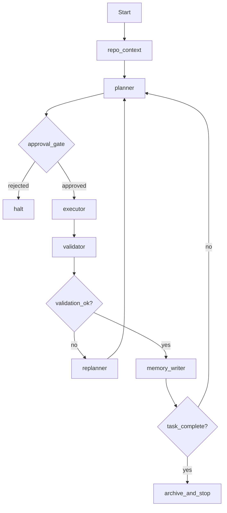

I’m drafting the exact LangGraph node graph and state schema for the Astro-Flow-3D agent so it maps directly to the six-day roadmap and the repo’s current pipeline.

## LangGraph framework for this repo

This is the graph I recommend for the Astro-Flow-3D local agent. It matches the six-day roadmap and keeps the model in a safe, observable loop.



### Why this graph fits the project
- The agent is not just a “chatbot”; it is a workflow with execution and validation.
- The planner generates a safe task plan, not arbitrary commands.
- The executor is strictly gated.
- The validator enforces science + repo-level correctness.
- Memory persists run provenance and artifact details.
- Replanning happens only on failure or incomplete work.

---

## Recommended node definitions

### 1) repo_context
Purpose:
- summarize repo state
- load only relevant context
- keep the local model prompt small and structured

Input:
- repo_root
- objective
- config
- file summaries

Output:
- repo_snapshot
- relevant_paths
- current_pipeline_summary
- constraints

### 2) planner
Purpose:
- convert objective into a safe task list
- decide which repo functions or scripts to call
- generate substeps and expected artifacts

Input:
- objective
- repo_snapshot
- tool_registry
- previous_run_history

Output:
- plan
- selected_tools
- expected_outputs
- risk_level

### 3) approval_gate
Purpose:
- block dangerous or unreviewed actions
- require human approval for repo mutation or broad commands

Input:
- plan
- risk_level
- requested_commands

Output:
- approved / rejected / manual_review_needed

### 4) executor
Purpose:
- run allowed commands only
- capture stdout/stderr, exit codes, times
- produce artifacts

Input:
- approved_plan
- command_allowlist
- cwd

Output:
- command_history
- exit_code
- stdout
- stderr
- artifact_paths
- runtime_seconds

### 5) validator
Purpose:
- check repo correctness and scientific plausibility
- return structured pass/fail

Input:
- task_id
- artifact_paths
- outputs
- expected_artifacts
- config

Output:
- validation_report
- metrics
- failures
- status

### 6) memory_writer
Purpose:
- persist task state and provenance
- keep run history
- preserve artifact hashes and run metadata

Input:
- task_id
- outputs
- validation_report
- command_history
- git_sha / env snapshot

Output:
- memory_record
- run_manifest

### 7) replanner
Purpose:
- handle failure and partial work
- decide whether to retry, revise the plan, or stop

Input:
- validation_report
- command_history
- previous_plan

Output:
- revised_plan
- retry_count
- next_action

---

## State schema

This is the state object I would use in LangGraph.

```python
from typing import Any, Dict, List, Literal, Optional, TypedDict

class CommandRecord(TypedDict):
    command: str
    cwd: str
    exit_code: int
    stdout: str
    stderr: str
    runtime_seconds: float
    timestamp: str

class ArtifactRecord(TypedDict):
    path: str
    kind: str
    sha256: str
    size_bytes: int
    created_at: str

class ValidationReport(TypedDict):
    task_id: str
    status: Literal["pass", "fail", "error"]
    metrics: Dict[str, Any]
    failures: List[Dict[str, Any]]
    created_at: str

class TaskStep(TypedDict):
    task_id: str
    objective: str
    tool: str
    args: Dict[str, Any]
    expected_outputs: List[str]
    risk_level: Literal["low", "medium", "high"]

class RunManifest(TypedDict):
    run_id: str
    task_id: str
    created_at: str
    git_sha: Optional[str]
    environment_snapshot: Dict[str, Any]
    config_snapshot: Dict[str, Any]
    command_history: List[CommandRecord]
    artifact_paths: List[str]
    validation_report_path: Optional[str]

class AgentState(TypedDict):
    # identity and lifecycle
    run_id: str
    task_id: str
    objective: str
    status: Literal[
        "queued",
        "context_loaded",
        "planned",
        "awaiting_approval",
        "approved",
        "running",
        "validated",
        "replanning",
        "failed",
        "completed",
        "halted"
    ]

    # user / repo context
    repo_root: str
    user_request: str
    repo_snapshot: Dict[str, Any]
    config: Dict[str, Any]

    # planning
    plan: List[TaskStep]
    selected_tools: List[str]
    approval_status: Literal["pending", "approved", "rejected", "manual_review"]

    # execution
    command_history: List[CommandRecord]
    artifact_paths: List[str]
    artifacts: List[ArtifactRecord]

    # validation
    validation_report: Optional[ValidationReport]

    # memory / provenance
    run_manifest: Optional[RunManifest]
    memory_log: List[Dict[str, Any]]

    # control flow
    retry_count: int
    max_retries: int
    next_action: Optional[str]
    error: Optional[str]
```

---

## Recommended node transition behavior

### Start
- Start with a single user objective
- create run_id and task_id
- set status = queued

### repo_context
- summarize the repo and select relevant files
- set status = context_loaded

### planner
- produce plan
- set status = planned

### approval_gate
- if risk is low, auto-approve
- if medium/high, require approval
- set status = awaiting_approval or approved

### executor
- run allowed commands only
- update command_history and artifact_paths
- set status = running

### validator
- run repo-level and science-level checks
- set validation_report
- set status = validated if pass, failed if fail

### memory_writer
- persist run manifest and artifact records
- save the validation report

### replanner
- if validation fails:
  - revise the plan
  - retry_count += 1
  - if retry_count <= max_retries, route back to planner
  - else mark failed
- if validation passes and task is complete:
  - archive and stop

---

## Practical local-model design

### qwen-code-3.5-30b
Use it as:
- planner
- task decomposer
- code patch proposer
- log summarizer

Keep it out of:
- direct shell execution
- branch logic that bypasses validation
- autonomous repo mutation

### ViT path
Use a small pretrained model:
- ViT-S/16 MAE-pretrained
- or Swin-Tiny
- or ConvNeXt-Tiny

Use it only in a dedicated vision node:
- feature extraction
- masked-band adaptation
- small supervised head
- not in the core planner loop

This makes the graph clean:
- planner node = qwen
- vision node = pretrained ViT
- executor/validator nodes = deterministic and safe

---

## Final recommendation

The best architecture is:

- LangGraph as the main runtime
- qwen-code-3.5-30b as the planner/code assistant
- a small pretrained ViT or Swin model as the vision feature backbone
- strict validation gate before any success is recorded
- memory-driven workflow with re-planning on failure

This is realistic and matches the six-day roadmap.